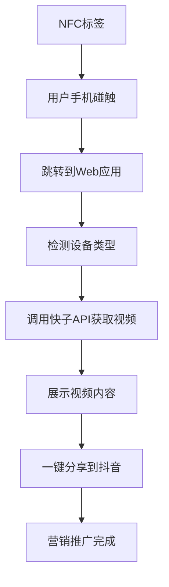

# 🔥 NFC抖音视频营销工具

> 基于NFC技术和抖音SDK的创新营销推广工具，通过碰一碰NFC标签直接发布抖音视频

## ✨ 核心特性

- 🏷️ **NFC一碰即发**: 碰触NFC标签即可获取并分享视频
- 📱 **移动端优先**: 专为移动设备优化的响应式设计
- 🎬 **快子API集成**: 海量短视频素材库
- 📲 **抖音SDK集成**: 一键分享到抖音平台
- ⚡ **边缘计算**: Cloudflare Workers全球加速
- 🔒 **企业级安全**: 完整的认证和速率限制

## 🚀 快速部署

### 方式一：一键自动部署 (推荐)

```bash
# 克隆项目
git clone https://github.com/your-username/nfc-douyin-video.git
cd nfc-douyin-video

# 一键部署到Cloudflare
node deploy-cloudflare.js
```

### 方式二：GitHub集成部署

1. **Fork项目到你的GitHub**

2. **连接Cloudflare Pages**
   - 访问 [Cloudflare Dashboard](https://dash.cloudflare.com)
   - 选择 "Workers & Pages" → "创建应用程序"
   - 选择 "Pages" → "连接到Git"
   - 选择你的GitHub仓库

3. **配置构建设置**
   ```
   框架预设: 无 (None)
   构建命令: npm run build:all
   输出目录: client/dist
   根目录: /
   Node.js版本: 18
   ```

4. **设置环境变量**
   ```
   KUAIZI_APP_KEY=你的快子API密钥
   KUAIZI_APP_SECRET=你的快子API秘钥
   KUAIZI_ACCOUNT_ID=你的快子账户ID
   DOUYIN_APP_ID=抖音应用ID
   DOUYIN_APP_SECRET=抖音应用密钥
   ```

### 方式三：命令行部署

```bash
# 安装依赖
npm run install:deps

# 登录Cloudflare
npm run cf:login

# 创建KV存储
npm run kv:create

# 构建项目
npm run build:all

# 部署
npm run deploy
```

## 🛠️ 技术架构

### 前端技术栈
- **Vue.js 3** - 现代前端框架
- **Vite** - 快速构建工具
- **Vant UI** - 移动端组件库
- **PWA** - 渐进式Web应用

### 后端技术栈
- **Cloudflare Workers** - 边缘计算平台
- **KV Storage** - 分布式键值存储
- **Static Assets** - CDN静态资源服务

### 第三方集成
- **快子OpenAPI** - 短视频素材服务
- **抖音开放平台** - 社交媒体分享
- **NFC技术** - 近场通信触发

## 📱 使用流程



## 🔧 配置说明

### 环境变量

| 变量名 | 说明 | 必需 |
|--------|------|------|
| `KUAIZI_APP_KEY` | 快子API应用密钥 | ✅ |
| `KUAIZI_APP_SECRET` | 快子API应用秘钥 | ✅ |
| `KUAIZI_ACCOUNT_ID` | 快子账户ID | ✅ |
| `DOUYIN_APP_ID` | 抖音开放平台应用ID | ✅ |
| `DOUYIN_APP_SECRET` | 抖音开放平台应用密钥 | ✅ |
| `NODE_ENV` | 运行环境 | 可选 |
| `DOMAIN` | 自定义域名 | 可选 |

### NFC标签配置

**标准URL格式:**
```
https://your-app.pages.dev/api/nfc/redirect?store_id=商户ID&category=视频分类
```

**支持的视频分类:**
- `general` - 通用视频
- `food` - 美食类视频  
- `lifestyle` - 生活类视频
- `product` - 产品展示
- `service` - 服务介绍

**配置示例:**
```
# 餐厅美食推广
https://your-app.pages.dev/api/nfc/redirect?store_id=restaurant001&category=food

# 商店通用推广
https://your-app.pages.dev/api/nfc/redirect?store_id=shop001&category=general
```

## 📊 API接口

### NFC相关接口

| 接口 | 方法 | 说明 |
|------|------|------|
| `/api/nfc/redirect` | GET | NFC跳转处理 |
| `/api/nfc/videos` | GET | 获取视频列表 |
| `/api/nfc/account` | GET | 获取账户信息 |
| `/api/nfc/trigger` | POST | 手动触发视频获取 |

### 系统接口

| 接口 | 方法 | 说明 |
|------|------|------|
| `/health` | GET | 健康检查 |
| `/api` | GET | API信息 |

### 抖音集成

| 接口 | 方法 | 说明 |
|------|------|------|
| `/api/douyin/callback` | GET | 抖音分享回调 |
| `/api/douyin/share` | POST | 生成分享链接 |

## 🏗️ 项目结构

```
📁 项目根目录/
├── 📄 wrangler.toml              # Cloudflare Workers配置
├── 📄 package.json               # 项目配置和脚本
├── 📄 deploy-cloudflare.js       # 一键部署脚本
├── 📁 client/                    # Vue前端应用
│   ├── 📄 package.json           # 前端依赖管理
│   ├── 📄 vite.config.js         # Vite构建配置
│   ├── 📄 index.html             # 入口HTML
│   └── 📁 src/                   # Vue源代码
│       ├── 📄 App.vue            # 根组件
│       ├── 📄 main.js            # 应用入口
│       ├── 📁 pages/             # 页面组件
│   │   └── 📁 router/            # 路由配置
│   ├── 📁 server/                    # Workers后端
│   │   ├── 📄 index.js               # Workers入口文件
│   │   ├── 📁 routes/                # API路由处理
│   │   │   ├── 📄 router.js          # 路由系统
│   │   │   ├── 📄 nfc.js             # NFC相关路由
│   │   │   ├── �� kuaizi.js          # 快子API路由
│   │   │   └── 📄 douyin.js          # 抖音API路由
│   │   ├── 📁 middleware/            # 中间件
│   │   │   ├── 📄 cors.js            # CORS处理
│   │   │   └── 📄 rateLimit.js       # 速率限制
│   │   ├── 📁 services/              # 业务服务
│   │   │   └── 📄 kuaiziService.js   # 快子API服务
│   │   └── 📁 utils/                 # 工具函数
│   │       ├── 📄 response.js        # 响应格式化
│   │       └── 📄 validation.js      # 输入验证
│   └── 📁 docs/                      # 项目文档
│       ├── 📄 CLOUDFLARE_GIT_DEPLOY.md  # Git部署指南
│       └── 📄 API.md                 # API文档
```

## 🎯 核心优势

### 🌐 全球部署
- **Cloudflare CDN**: 全球200+节点加速
- **边缘计算**: 就近处理，极低延迟
- **智能路由**: 自动选择最优路径

### 📈 性能优化
- **静态资源缓存**: 自动CDN缓存优化
- **API响应缓存**: 智能缓存策略
- **移动端适配**: 响应式设计，完美适配各种设备

### 🔐 安全保障
- **速率限制**: 防止API滥用
- **CORS保护**: 跨域安全策略
- **输入验证**: 完整的参数校验
- **错误处理**: 优雅的错误处理机制

### 💰 成本控制
- **按需付费**: 仅为实际使用付费
- **免费额度**: Cloudflare免费套餐支持
- **无服务器**: 零运维成本

## 🧪 测试验证

### 本地测试
```bash
# 启动开发服务器
npm run dev

# 构建生产版本
npm run build

# 本地预览
npm run preview
```

### 部署测试
```bash
# 健康检查
curl https://your-app.pages.dev/health

# API信息
curl https://your-app.pages.dev/api

# NFC跳转测试
curl "https://your-app.pages.dev/api/nfc/redirect?store_id=test&category=general"
```

## 📚 详细文档

- 📖 [完整部署指南](./CLOUDFLARE_GIT_DEPLOY.md)
- 🔧 [API接口文档](./docs/API.md)
- 🚀 [性能优化指南](./docs/PERFORMANCE.md)
- 🔒 [安全配置指南](./docs/SECURITY.md)

## 🤝 贡献指南

欢迎提交Issue和Pull Request来改进项目！

### 开发流程
1. Fork项目到你的GitHub
2. 创建功能分支: `git checkout -b feature/amazing-feature`
3. 提交更改: `git commit -m 'Add amazing feature'`
4. 推送分支: `git push origin feature/amazing-feature`
5. 创建Pull Request

## 📄 开源协议

本项目采用 [MIT License](./LICENSE) 开源协议。

## 📞 技术支持

### 获取帮助
- 📧 技术支持: support@yourcompany.com
- 💬 在线聊天: [Discord频道](https://discord.gg/yourproject)
- 📖 文档中心: [项目Wiki](https://github.com/your-username/nfc-douyin-video/wiki)

### 常见问题
- 🔍 [FAQ文档](./docs/FAQ.md)
- 🐛 [已知问题](https://github.com/your-username/nfc-douyin-video/issues)
- 💡 [功能建议](https://github.com/your-username/nfc-douyin-video/discussions)

---

**🎉 开始你的NFC视频营销之旅，让传统营销焕发数字化活力！**

[](https://deploy.workers.cloudflare.com/?url=https://github.com/your-username/nfc-douyin-video) 